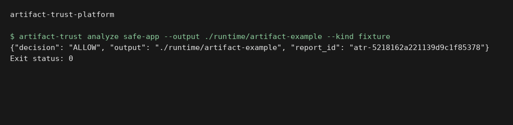

# Artifact Trust Platform

Artifact Trust Platform turns a local fixture or a validated, commit-pinned HTTPS Git
repository into evidence that a publication gate can verify. The default pipeline is
offline, deterministic, and deliberately does not execute repository code.

## Execution preview



Local execution of `artifact-trust analyze safe-app --output ./runtime/artifact-example --kind fixture`. The input and output shown come from the repository example or test fixtures. [Verification](docs/verification.md).

## What works

- safe source acquisition: named fixtures, allowlisted local roots, or HTTPS Git with an
  exact 40-character commit SHA and host allowlist;
- descriptor-based, no-follow snapshots for mutable local and fixture trees before analysis;
- file-count, file-size, total-size, CPU, memory, process and wall-clock limits;
- deterministic source bundle and SHA-256 tree digest;
- npm package-lock v2/v3 and Python PEP 621/requirements parsing;
- explicit direct and transitive dependency graph;
- CycloneDX 1.6 JSON SBOM;
- offline secret, license, manifest-quality and vulnerability checks;
- transparent 0–100 security score with per-finding deductions;
- signed in-toto Statement v1 with a SLSA v1-shaped provenance predicate;
- Ed25519 DSSE signature over a closed eight-file evidence set, with every digest verified;
- deterministic `ALLOW`, `QUARANTINE`, or `REJECT` policy, with a matching Rego policy;
- JSON and self-contained HTML reports;
- CLI, FastAPI control plane, dashboard, atomic file queue, and separate worker process;
- controlled byte-tampering scenario that must end in `REJECT`;
- benchmark harness reporting measured p50 and p95 latency;
- optional Syft, Grype, and Gitleaks adapters, never enabled implicitly.

## Quick start

Requirements: Python 3.12 and uv 0.11.23 or a compatible newer uv release.

```bash
uv sync --locked --extra dev
uv run artifact-trust keygen \
  --private-key signing-key.pem \
  --public-key verification-key.pem
ATP_PRIVATE_KEY="$PWD/signing-key.pem" \
ATP_PUBLIC_KEY="$PWD/verification-key.pem" \
uv run artifact-trust analyze safe-app \
  --kind fixture \
  --policy-engine fallback \
  --output out
```

A successful safe-fixture run exits 0 and writes:

| File | Purpose |
|---|---|
| `artifact.tar.gz` | deterministic source bundle; repository code was not run |
| `sbom.cdx.json` | CycloneDX 1.6 SBOM |
| `dependency-graph.json` | nodes, edges and adjacency list |
| `findings.json` | redacted normalized findings |
| `policy-input.json` | complete deterministic decision input |
| `decision.json` | policy input, policy result and risk assessment used by the gate |
| `provenance.dsse.json` | DSSE-signed in-toto/SLSA-shaped provenance binding all eight evidence files |
| `verification-key.pem` | convenience copy of the public key; not a trust anchor by itself |
| `report.json` | machine-readable consolidated result |
| `report.html` | self-contained human-readable result |

Verify the complete bundle with a public key obtained through a trusted, out-of-band channel:

```bash
uv run artifact-trust verify \
  --artifact out/artifact.tar.gz \
  --provenance out/provenance.dsse.json \
  --public-key verification-key.pem
```

The verifier requires the exact subject set `artifact.tar.gz`, `decision.json`,
`dependency-graph.json`, `findings.json`, `policy-input.json`, `report.html`, `report.json`, and
`sbom.cdx.json`. A partial artifact-only envelope is rejected instead of silently downgrading the
verification contract.

## Policy gate

The CLI exits 0 only for `ALLOW` when enforcement is enabled. It exits 2 for
`QUARANTINE`, 3 for `REJECT`, and 1 for a processing failure. `--no-enforce` keeps the
reporting workflow at exit 0 while preserving the decision in the report.

| Condition | Decision |
|---|---|
| invalid signature/provenance/evidence digest, incomplete manifest integrity, unpinned source/dependency, secret, critical vulnerability, disallowed license | `REJECT` |
| high/medium vulnerability, unknown license or missing supported manifest | `QUARANTINE` |
| all mandatory controls pass | `ALLOW` |

`src/artifact_trust/data/policy.rego` expresses the same rules. `--policy-engine auto`
uses OPA only when its decision, reasons and policy version exactly match the deterministic
fallback; otherwise it uses that fallback. `--policy-engine opa` fails closed when OPA is absent,
returns an invalid document or diverges.

## Controlled tampering proof

```bash
ATP_PRIVATE_KEY="$PWD/signing-key.pem" \
ATP_PUBLIC_KEY="$PWD/verification-key.pem" \
uv run artifact-trust attack safe-app --output attack-out
```

The scenario signs a clean artifact, appends controlled bytes to a copy, verifies that
the signature remains cryptographically valid but the subject digest no longer matches,
and requires a final `REJECT`. The command fails if publication is not blocked.

## API and worker

The API validates and queues requests. It never imports the worker child and never runs an
analysis. Start the two processes separately:

```bash
ATP_WORK_ROOT="$PWD/.artifact-trust" \
ATP_PUBLIC_KEY="$PWD/verification-key.pem" \
uv run artifact-trust serve
ATP_WORK_ROOT="$PWD/.artifact-trust" \
ATP_PRIVATE_KEY="$PWD/signing-key.pem" \
ATP_PUBLIC_KEY="$PWD/verification-key.pem" \
uv run artifact-trust worker
```

Submit the inert fixture:

```bash
curl --fail-with-body -X POST http://127.0.0.1:8000/api/v1/jobs \
  -H 'content-type: application/json' \
  -d '{"source":{"kind":"fixture","location":"safe-app"},"policy_engine":"fallback"}'
```

The dashboard is at `http://127.0.0.1:8000/`; OpenAPI is at `/docs`.

## Commit-pinned Git input

Network access is off by default. Enabling it authorizes only the built-in `git` fetch
operation, never build scripts or package-manager hooks:

```bash
uv run artifact-trust analyze https://github.com/OWNER/REPOSITORY.git \
  --kind git \
  --commit 0123456789abcdef0123456789abcdef01234567 \
  --allow-network \
  --allowed-host github.com \
  --output out
```

The fetch uses no shell, disables prompts, hooks and HTTP redirects, accepts only HTTPS port 443, rejects
credentials/query strings/fragments, verifies the exact fetched commit, archives it with
Git, then rejects links and special files during extraction.

## Docker

```bash
docker compose up --build
```

Set `ATP_PORT=18080` before the command when local port 8000 is already occupied.

The default API and worker use distinct UIDs. They share one queue filesystem so claims remain
atomic. A one-shot, networkless init service establishes numeric ownership on fresh `nocopy`
volumes before either long-running service starts. The API can write only `pending`; completed
state is worker-owned, results are mounted read-only into the API, and the private-key volume is
mounted only into the worker. The worker has no network, a read-only root filesystem, dropped
capabilities, `no-new-privileges`, PID/memory/CPU limits, and an ephemeral `noexec` source
snapshot. See `docs/architecture.md` before enabling remote Git acquisition.

## Optional scanners

External adapters are explicit and separate from the reproducible core:

```bash
uv run artifact-trust external-scan syft fixtures/safe-app --output syft.cdx.json
uv run artifact-trust external-scan grype out/sbom.cdx.json --output grype.json
uv run artifact-trust external-scan gitleaks fixtures/safe-app --output gitleaks.json
```

Pin each external binary and its database in the deployment image. Grype automatic database
updates and tool update checks are disabled by the adapter. External results are supplemental
and are not silently substituted for built-in controls.

## Benchmark and validation

```bash
uv run artifact-trust benchmark safe-app --iterations 20 --warmups 2 --output metrics.json
uv run ruff format --check src tests
uv run ruff check src tests
uv run mypy src
uv run pytest --cov=artifact_trust --cov-report=term-missing
```

The measured numbers depend on the host; the command records iterations, p50, p95, mean,
minimum and maximum. `benchmarks/baseline.json` records one dated run with its host and source
context. On that machine, the hardened three-file fixture pipeline measured p50 3.435 ms and p95
4.494 ms over 20 measured runs after two warmups. This is not a production-capacity claim. Golden
tests separately prove byte reproducibility with a fixed key.

## Documentation

- [Architecture](docs/architecture.md)
- [Methodology and evidence contracts](docs/methodology.md)
- [Threat model](docs/threat-model.md)
- [Known limitations](docs/limitations.md)
- [Security policy](SECURITY.md)
- [Contribution guide](CONTRIBUTING.md)

## License

MIT. Test-only keys and synthetic fixtures are public data and establish no production trust.
